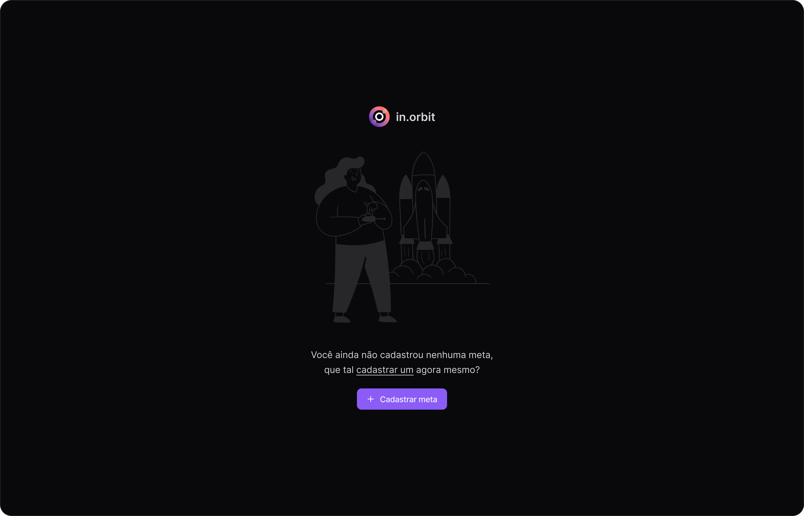
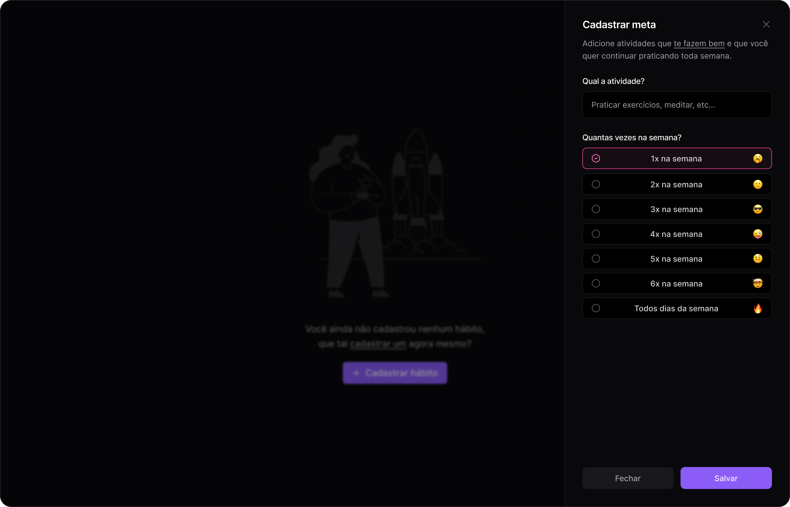
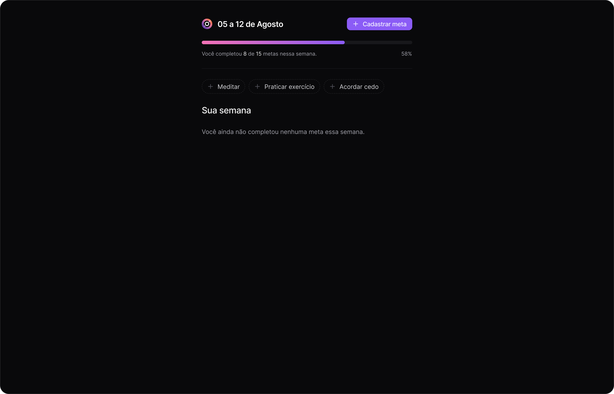
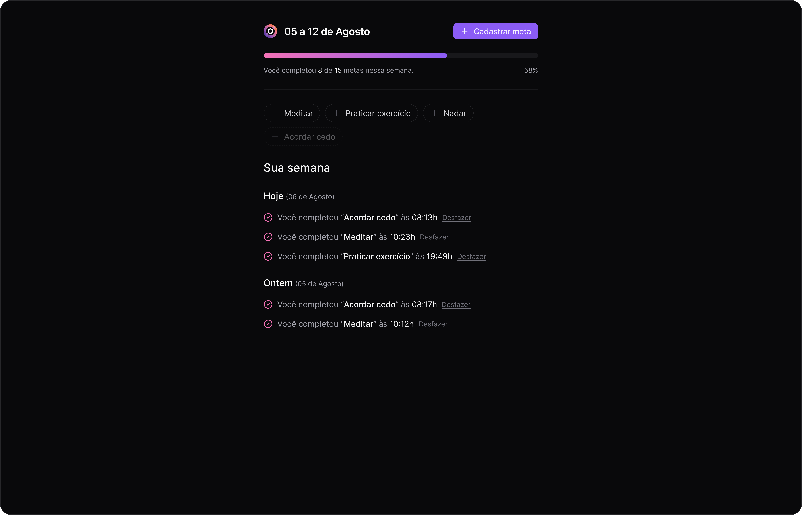

<h1 align="center">
  
</h1>

<ul>
  <li>
    <a href="#sobre-o-projeto">
      Sobre o projeto
    </a>
  </li>
  <li>
    <a href="#tecnologias">
      Tecnologias
    </a>
  </li>
  <li>
    <a href="#pre-requisitos">
      Pré-requisitos
    </a>
  </li>
  <li>
    <a href="#como-instalar-o-projeto">
      Como instalar o projeto
    </a>
  </li>
  <li>
    <a href="#como-executar-o-projeto">
      Como executar o projeto
    </a>
  </li>
  <li>
    <a href="#autor">
      Autor
    </a>
  </li>
  <li>
    <a href="#Licença">
      Licença
    </a>
  </li>
</ul>









## Sobre o projeto

Front-end em React do projeto full stack de registro de metas com progresso semanal desenvolvido no NLW Pocket trilha intermediário da Rocketseat.

## Tecnologias

O projeto foi desenvolvido com as seguintes tecnologias:

- [React](https://react.dev)
- [Vite](https://vitejs.dev)
- [TypeScript](https://www.typescriptlang.org)
- [Tailwind CSS](https://tailwindcss.com)
- [Day.js](https://day.js.org)
- [Biome](https://biomejs.dev/pt-br)
- [Zod](https://zod.dev)

## Pré-requisitos

Verifique aos seguintes pré-requisitos para poder instalar e executar o projeto:

1. Ter instalado um editor de código: [VS Code](https://code.visualstudio.com/download), [Sublime Text](https://www.sublimetext.com), [Nodepad++](https://notepad-plus-plus.org)
2. Ter instalado o [Git](https://git-scm.com/downloads)
3. Ter instalado o [Node.js](https://nodejs.org/pt)

## Como instalar o projeto

Siga o passo a passo para instalar o projeto:

1. Abra o terminal e clone o repositório do projeto:

```bash
git clone https://github.com/pedroeuzebiooo/nlw-pocket-react-trilha-intermediario
```

## Como executar o projeto

Siga o passo a passo para executar o projeto:

1. Entre na pasta do projeto clonado:

```bash
cd nlw-pocket-react-trilha-intermediario
```

2. Abra a pasta do projeto clonado no editor de código de sua preferência. Caso seja o VS Code digite o comando:

```bash
code .
```

3. Instale as dependências

```bash
npm install
```

ou

```bash
yarn install
```

ou

```bash
pnpm install
```

4. Execute o projeto

```bash
npm run dev
```

ou

```bash
yarn run dev
```

ou

```bash
pnpm run dev
```

## Autor

<table>
  <tr>
    <td align="center">
      
      <br />
      Pedro Euzebio
    </td>
  </tr>
</table>

## Licença

O projeto está sob licença MIT. Veja o arquivo [LICENSE](./LICENSE) para mais detalhes.
